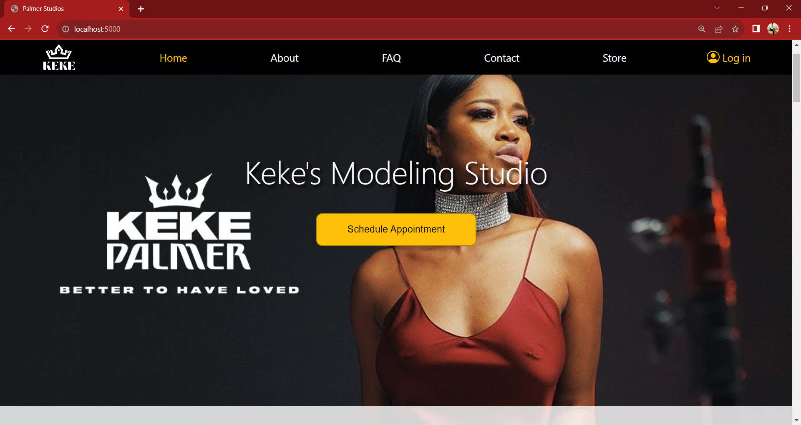

# Palmer Studios

### Description
This is one of my bigger Projects that I started building when I was 16. I originally Started building this project using Bootstrap, but as I taught myself more, practiced, got more fluent in Javascript, and learned other languages such as Node.js and SQL. I wanted to build a real Fullstack application to apply all that I've learned. Unfortuately, I never had any great ideas or anything on what to build. So I decided to pretend like I'm building a site for a company called Palmer Studios (Keke Palmer my celebrity crush). Building this project was difficult because I had no clear vision on how i'd want to layout/display/design everything. I tried not to focus on it so much, and instead just build something using the advanced technologies that I learned. I have to say that I think this project turned out very good for a person my age.

- I was motivated to build this project to improve on my skills in HTML, CSS, JavaScript, Node.js, SQL, debugging, staying organized, shortcuts, swiftness with coding, etc. The main benifit I got though out of this project is Problem Solving.

## Features
- Validates User input on all pages that has inputs.
- Collects data, and performs C.R.U.D opperations to SQL database
- Sends Users Emails
- Responsive Layout on all pages
- Accounts can be created
- Passwords can be resetted
- Cool Animations and Hover Affects

## Technologies Used
- HTML
- CSS
- JavaScript
- Node.js
- SQL
- Bootstrap

## Libraries Used
- Bcrypt
- Dotenv
- Express
- Fs
- Mailgen
- Mysql2
- Nodemailer

Deployed Site: Coming Soon!

GitHub Repo: https://github.com/Batking74/Kekes_Model_Website/tree/frontend